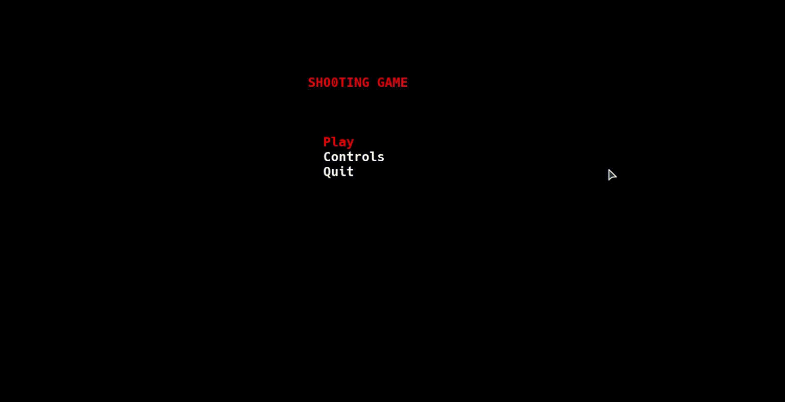

# LDTS - ***Shooting Game***

In this project we are developing a survival shooting game where to win you must go through all the levels, while defending yourself against, and killing, a number of enemies.

You will spawn in a pre generated map, having access to a shop where you can get weapons and are able to buy new ones throughout your playthrough.

To win you must take out all the enemies without dying.

This project was developed by António Rodolfo de Almeida Seara Ferreira (up202108834), Henrique Correia Vicente (up202005321) and Rúben Tiago Oliveira Silva (up202005334).

## Preview

#### Gif.1 In-Game Gif

## Implemented features

- Health - Shows how many hit points the game character has.
- Controls - Menu that shows every possible control in the game.
- Player movement - The game character will move when pressing the keys W, A, S or D.
- Weapons - Player will have access to different weapons to fight the enemies.
- Combat - The game character will fight the enemies in order to survive, using the arrow keys to shoot in the key's direction.
- Usable menu - This menu will have the option to play the game, see the different controls and quit the game.
- Shop - This will be used by the player to buy better weapons. Access the shop menu by pressing B while in-game.
- Enemies - Different types of enemies, each type has a different amount of hit points.
- Collision detection - The game character cannot go through walls. An enemy also has collision, and each time an enemy touches the player he loses 1 hit point.
- Bullets - Every time the player shoots his weapon, the bullets will travel and be visible on its last position.
- Coins - Every time an enemy is killed he will disappear and a coin will spawn in the exact same position the enemy died. The player can pick up these coins to be able to buy better weapons or more health.
- Ability to pause the game - Access the pause menu by pressing ESC.

## Screenshots

#### Fig.1 Main Menu

#### Fig.2 Controls Menu

#### Fig.3 Death Menu

#### Fig.4 Level 1

#### Fig.5 Level 2

#### Fig.6 Level 3

## Design
### Pattern 1 - MVC
This project will be built with the MVC pattern, based on the hero solid project shown in lectures.
It divides the application into three parts (model, controller, viewer), each part with a different job, allowing for a seperation of functions according to their role in the game.
The model is responsible to store the components of the game, for example the weapons, the enemy and the coin.
The viewer will draw the components on the screen.
The controller for taking command of the player and some other components.

#### Consequences:

- The MVC pattern introduces new levels of indirection and thereof increases the complexity of the solution.
- It also increases the event-driven nature of the user-interface code, which can become more difficult to debug.
- Developers cannot completely ignore the view of the model even if they are decoupled.
- This pattern is also not suitable for small applications.

### Pattern 2 - State
The second pattern we decided to use was the state pattern. We used this pattern in order to add different menus to our game(main menu, endgame menu, pause menu, shop menu).
This pattern will control in each part of the game, the player's menu.

#### Implementation:

#### Fig.7 StatePattern
#### Consequences:

- Single Responsibility Principle.
- Open/Closed Principle.

### Pattern 3 - Factory

This pattern was used to organize the components in the game and since all components have something in common, we decided to create a new object that will help us with this.
We created a class called "element" that could be used to implement all the elements easily, adapting each element to fit its purpose.

#### Implementation :

#### Fig.8 FactoryPattern

#### Consequences:

- Single Responsibility Principle
- Open/Closed Principle.

### Complete Implementation

The following image shows the structure implemented:

#### Fig.9 UML-Diagram

## Testing
### Inside the GUI folder

#### Fig.10 GUI_Tests_Coverage

### Inside the Controller folder

#### Fig.11 Controllers_Tests_Coverage

### Inside the States folder

#### Fig.12 States_Tests_Coverage

### Inside the Model folder

#### Fig.13 Models_Tests_Coverage

### Inside the Viewer folder

#### Fig.14 Viewers_Tests_Coverage

### Pitest

#### Fig.15 Pitest_Report

## Self-Evaluation
Work was distributed among all group members according to the time available by each one.
We all enjoyed working on this project as it helped us learn and understand better this programming language and how to better organize our code.

António Rodolfo de Almeida Seara Ferreira: 35%
Henrique Correia Vicente: 30%
Rúben Tiago Oliveira Silva: 35%
